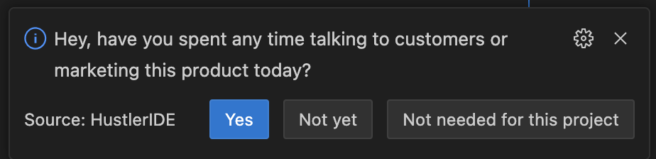
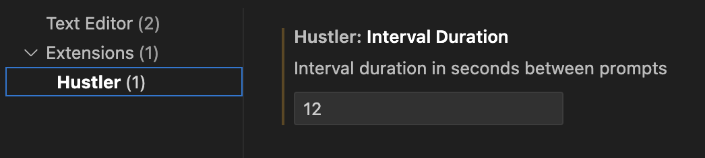

# Hustler IDE Extension
This extension provides periodic prompts to remind you to reach out to customers and market your product.

## Features

- Prompts user with marketing reminder
- Options to snooze prompt for the day or disable completely
- Configurable prompt interval from settings

## Usage
The prompt will automatically start displaying at the configured interval once the extension is installed.

You can also use the command "Show prompt to talk to users" to manually trigger the prompt.

> Tip: You can use the hotkeys Shift+Cmd+P (on MacOS) and Shift+Ctrl+P (on Windows and Linux) and type the command name to manually trigger the prompt.

When the prompt appears, you can:
- Click "Yes" to snooze prompts for the day
- Click "Not Yet" to keep prompting at set interval
- Click "Not Needed" to disable prompts

## Extension Settings

* `hustler.intervalDuration`: Set the duration between two prompts in seconds. We recommend setting this to the average duration of your focus sessions.

This is set to 3600 seconds (1 hour) by default. To change:

- Open Settings (Cmd+,)
- Search for "Hustler"
- Update "Interval Duration" with desired timing in seconds

## Requirements

Works on VSCode versions 1.87.0 and later.

## Contributions
Contributions are welcome! Please open issues and pull requests on [the GitHub repository](https://github.com/Alokit-Innovations/HustlerIDE).

## License
This extension is licensed under the [Apache v2.0](LICENSE).

## Known Issues

1. Currently, the extension is not able to remember its state across sessions. So you might see the prompts again on the same day after pressing "Yes" if you restart VSCode
2. Project specific configuration is not supported yet. Pressing "Not Needed" will disable the prompts for all projects.

## Release Notes

### 0.0.1

Initial release of the HustlerIDE extension based on [this post on X](https://twitter.com/AvikalpGupta/status/1775056328785858633)